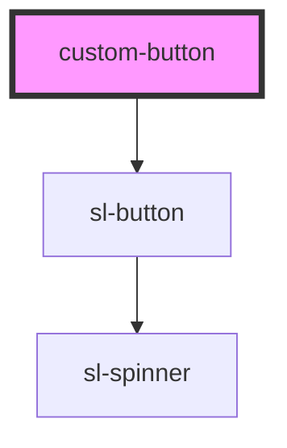

# custom-button

<!-- Auto Generated Below -->

## Properties

| Property | Attribute | Description | Type                                                                                              | Default     |
| -------- | --------- | ----------- | ------------------------------------------------------------------------------------------------- | ----------- |
| `type`   | `type`    |             | `"danger" \| "default" \| "info" \| "primary" \| "secondary" \| "success" \| "text" \| "warning"` | `'primary'` |

## Events

| Event     | Description | Type               |
| --------- | ----------- | ------------------ |
| `onClick` |             | `CustomEvent<any>` |

## Dependencies

### Depends on

- sl-button

### Graph

----------------------------------------------

*Built with [StencilJS](https://stenciljs.com/)*
