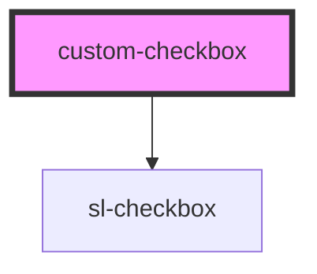

# custom-checkbox

<!-- Auto Generated Below -->

## Properties

| Property  | Attribute | Description | Type      | Default |
| --------- | --------- | ----------- | --------- | ------- |
| `checked` | `checked` |             | `boolean` | `false` |

## Dependencies

### Depends on

- sl-checkbox

### Graph

----------------------------------------------

*Built with [StencilJS](https://stenciljs.com/)*
