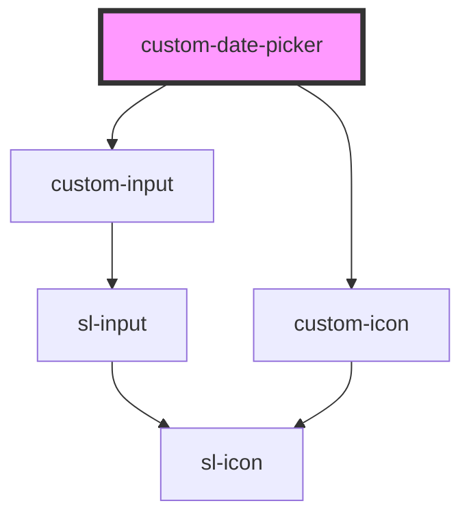

# custom-date-picker

<!-- Auto Generated Below -->

## Properties

| Property      | Attribute     | Description | Type      | Default     |
| ------------- | ------------- | ----------- | --------- | ----------- |
| `label`       | `label`       |             | `string`  | `undefined` |
| `placeholder` | `placeholder` |             | `string`  | `''`        |
| `required`    | `required`    |             | `boolean` | `false`     |

## Dependencies

### Depends on

- [custom-input](../custom-input)
- [custom-icon](../custom-icon)

### Graph

----------------------------------------------

*Built with [StencilJS](https://stenciljs.com/)*
