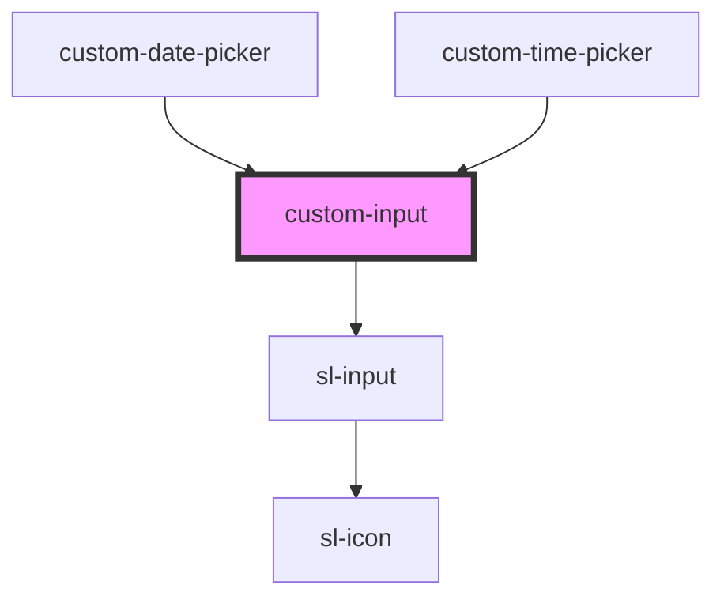

# custom-input

<!-- Auto Generated Below -->

## Properties

| Property      | Attribute     | Description | Type                                                                        | Default     |
| ------------- | ------------- | ----------- | --------------------------------------------------------------------------- | ----------- |
| `label`       | `label`       |             | `string`                                                                    | `undefined` |
| `placeholder` | `placeholder` |             | `string`                                                                    | `''`        |
| `required`    | `required`    |             | `boolean`                                                                   | `false`     |
| `type`        | `type`        |             | `"email" \| "number" \| "password" \| "search" \| "tel" \| "text" \| "url"` | `'text'`    |
| `value`       | `value`       |             | `string`                                                                    | `''`        |

## Dependencies

### Used by

 - [custom-date-picker](../custom-date-picker)
 - [custom-time-picker](../custom-time-picker)

### Depends on

- sl-input

### Graph

----------------------------------------------

*Built with [StencilJS](https://stenciljs.com/)*
