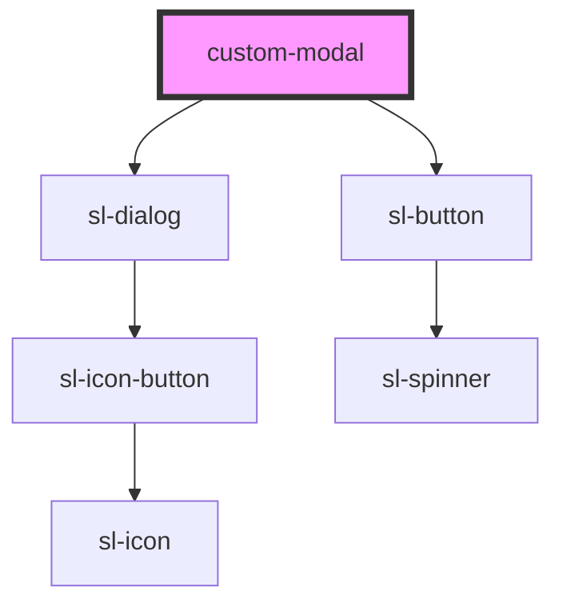

# custom-modal

<!-- Auto Generated Below -->

## Properties

| Property | Attribute | Description | Type      | Default     |
| -------- | --------- | ----------- | --------- | ----------- |
| `label`  | `label`   |             | `string`  | `undefined` |
| `open`   | `open`    |             | `boolean` | `false`     |

## Methods

### `hide() => Promise<void>`

#### Returns

Type: `Promise<void>`

### `show() => Promise<void>`

#### Returns

Type: `Promise<void>`

## Dependencies

### Depends on

- sl-dialog
- sl-button

### Graph

----------------------------------------------

*Built with [StencilJS](https://stenciljs.com/)*
