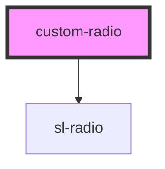

# custom-radio

<!-- Auto Generated Below -->

## Properties

| Property  | Attribute | Description | Type      | Default |
| --------- | --------- | ----------- | --------- | ------- |
| `checked` | `checked` |             | `boolean` | `false` |
| `name`    | `name`    |             | `string`  | `''`    |

## Dependencies

### Depends on

- sl-radio

### Graph

----------------------------------------------

*Built with [StencilJS](https://stenciljs.com/)*
